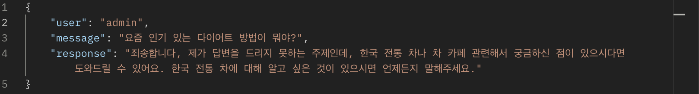

## Chat With GPT API

#### 🔹 개요

이 프로젝트는 Django REST Framework(DRF)와 OpenAI API를 활용하여, 사용자가 한국 전통 음료 카페 직원인 AI와 대화할 수 있도록 하는 API를 제공한다.

#### 🔹 주요 기능

- OpenAI API를 이용한 챗봇 응답 생성
- 사용자의 최근 대화 기록(최대 5개) 반영
- 사용자의 대화 기록을 데이터베이스에 저장
- 사용자의 대화 기록 삭제 기능
- JWT를 이용한 인증 및 로그인 기능
- 로그인한 사용자만 접근 가능

#### 🔹 기술 스택

- Backend: Django, Django REST Framework
- Database: SQLite (원하는 DB로 변경 가능)
- Authentication: JWT (JSON Web Token, rest_framework_simplejwt 사용)
- AI Model: OpenAI GPT-3.5-turbo
- Environment Management: dotenv (.env 파일 사용)

#### 🔹 API 엔드포인트

1. 회원가입

   - URL: POST /accounts/signup/
   - 설명: 새 사용자를 등록
   - Request Body:
     ```
     {
       "username": "your_username",
       "password": "your_password"
     }
     ```
   - Response:
     ```
     {
       "id": 1,
       "username": "your_username"
     }
     ```

2. 로그인 (JWT 발급)
   - URL: POST /accounts/login/
   - 설명: JWT 액세스 토큰과 리프레시 토큰 발급
   - Request Body:
     ```
     {
       "username": "your_username",
       "password": "your_password"
     }  
     ```
   - Response:
     ```
     {
       "access": "your_access_token",
       "refresh": "your_refresh_token"
     }
     ```

3. 로그아웃

   - URL: POST /accounts/logout/
   - 설명: JWT 리프레시 토큰을 서버에서 무효화
   - Request Body:
     ```
     {
       "refresh_token": "your_refresh_token"
     }  
     ```
   - Response:
     ```
     {
       "detail": "Successfully logged out"
     }
     ```

4. 회원탈퇴

   - URL: DELETE /accounts/user_delete/
   - 설명: 현재 로그인한 사용자를 DB에서 삭제
   - 권한: JWT 인증된 사용자만 가능
   - Response:
     ```
     {
       "message": "User deleted successfully"
     }  
     ```

5. GPT와 대화하기

   - URL: POST /chat/chat_start/
   - 설명: 사용자의 질문을 받아 GPT의 응답을 반환하며, 대화 기록을 DB에 저장
   - 권한: JWT 인증된 사용자만 가능
   - Request Body:
     ```
     {
       "message": "한국 전통 음료 중 하나를 소개해줘."
     }  
     ```
   - Response 예시:
     ```
     {
       "user": "username",
       "message": "한국 전통 음료 중 하나를 소개해줘.",
       "response": "식혜는 달콤한 한국 전통 음료로, 엿기름과 밥을 발효시켜 만듭니다."
     }
     ```

6. 대화 기록 삭제

   - URL: DELETE /chat/chat_delete/
   - 설명: 사용자의 전체 대화 기록을 삭제
   - 권한: JWT 인증된 사용자만 가능
   - Response:
     ```
     {
       "message": "All chat history for 'username' has been deleted."
     }  
     ```

### 

#### 🔸 추가적용사항

1. 프롬프트 가이드라인 (응답 제어 및 제한)

   - 사용자의 질문이 프롬프트 엔지니어링에 작성한 직무와 관련된 내용이 아닐 경우, 대답을 회피하고 직무에 알맞은 질문을 하도록 유도하는 가이드 라인을 추가한다.

➡️ 프롬프트 메시지에 다음과 같은 문장을 추가한다.
```
"If a question is unrelated to your role, politely decline to answer and suggest asking something about Korean tea instead."
```
### 

다음은 프로젝트에서 해당 사항을 적용한 뒤, 모델에게 직무와 관련 없는 질문을 한 예시이다.


이 메시지로 질문했을 때 모델은 다음과 같은 응답을 반환했다.


➡️ 그런데 이렇게만 하면 단순히 직무와 관련 없는 질문을 거절하는 컨텍스트 제어에 가깝다.

➡️ 앞서서 학습했던 **CoT(Chain of Thought) 기법을 적용해서 복잡한 문제를 단계적으로 사고**할 수 있도록 유도하자!

###

2. CoT(Chain of Thought) 적용

💡 CoT를 적용하려면, 단순히 답변을 제한하는 것이 아니라, 단계적으로 사고하도록 유도하는 방식으로 변경해야 한다.

##### **✅ CoT를 적용한 프롬프트 설계 방법**

   1. 질문의 의도를 분석하도록 지시하기
      - "사용자가 입력한 질문이 직무와 관련이 있는지 먼저 판단하라."
     
   2. 단계적으로 생각을 정리하도록 유도하기
      - "질문이 관련이 있다면, 답변을 제공하기 전에 필요한 개념을 먼저 설명하고 논리적으로 답을 도출하라."
      - "관련이 없다면, 사용자의 질문을 직무와 연결할 수 있는 방식으로 변형하여 다시 질문하라."

   3. 단계적 사고를 강화하는 문구 포함하기
      -  "이 문제를 해결하기 위해 필요한 요소를 순서대로 분석하라."
      - "중간 과정 없이 바로 답변하지 말고, 생각의 흐름을 설명하라."

##### ✅ 프로젝트에 적용하기

기존의 문장을 다음과 같이 변경하여 다시 추가한다.

```
"When answering a question, follow these steps:\n"
"1. Analyze whether the question is directly related to Korean traditional tea or café operations.\n"
"2. If related, provide a detailed and well-structured response.\n"
"3. If not directly related, think about whether the topic can be connected to traditional Korean tea in some way.\n"
"   - If a connection is possible, guide the user towards discussing Korean tea.\n"
"   - If no meaningful connection exists, politely decline to answer and suggest asking about Korean tea instead.\n"
"4. Always provide responses in a friendly and engaging manner, maintaining the persona of a knowledgeable café assistant."
```

##### ✅ 변경 후 기대되는 효과

1. 단순 거절이 아니라 "연결 가능성"을 탐색함
   - 기존 메시지는 관련 없는 질문에 대해 무조건 거절하는 방식이었지만, 새로운 메시지는 관련이 없더라도 한국 전통 차와 연결할 수 있도록 유도한다.

2. 논리적으로 생각하고 답변하도록 유도함
   - CoT 기법을 적용해서 AI가 답변 전에 "질문을 분석 → 연결 가능성 탐색 → 적절한 답변 생성"하는 방식으로 사고한다.

3. 더 자연스럽고 친근한 답변을 기대할 수 있음

   - 기존 메시지는 단순한 규칙을 따랐다면, 변경된 메시지는 "친근한 카페 직원"처럼 대화할 수 있도록 유도한다.
  
##### ✅ 예제 비교

🙋🏻‍♀️ 질문: "요즘 인기 있는 다이어트 방법이 뭐야?"

🤖 응답:

➡️ 기존 프롬프트 메시지 (단순 제한)

👉 사용자 입장에서 너무 차갑고 기계적인 응답임.

➡️ 새로운 프롬프트 메시지 (CoT 기법 적용)

👉 사용자가 원래 물어본 주제에서 벗어나지 않으면서도, 자연스럽게 한국 전통 차와 연결하는 방식으로 유도함.

✅ 이렇게 CoT 기법을 적용하여 질문을 단순히 회피하지 않고, 직무와 연결할 수 있는 방향으로 사고하도록 만들 수 있다!

### 

#### 🔹 주의사항

- API 사용 시 반드시 OpenAI API 키를 .env 파일에 설정해야 한다.

- 보안을 위해 .env 파일을 Git에 올리지 않도록 .gitignore에 추가해야 한다.

- **JWT를 사용하여 인증하므로, 클라이언트에서는 액세스 토큰을 포함하여 요청해야 한다.**

- **로그인 시 TokenObtainPairView를 사용**하므로, 별도의 로그인 뷰가 필요하지 않다.

- **로그아웃 시 액세스 토큰은 만료되지 않으므로 클라이언트 측에서 삭제해야 한다.**